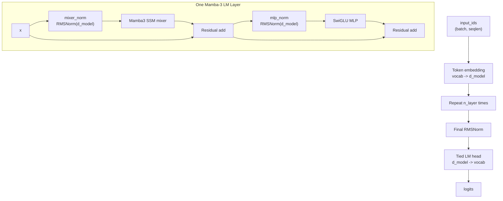
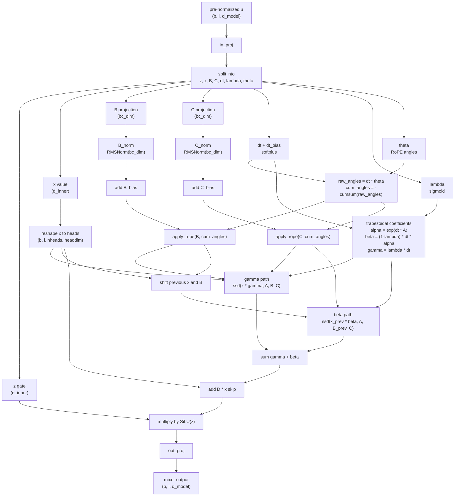
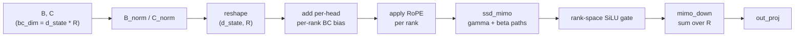

# Mamba-3 Minimal Architecture

This folder does not contain a module or class literally named `BCNorm`.
In this implementation, the BC normalization point is represented as QK-style
RMS normalization on the projected `B` and `C` tensors:

- `Mamba3.__init__`: `self.B_norm = RMSNorm(self.bc_dim)` and
  `self.C_norm = RMSNorm(self.bc_dim)` in `mamba3.py` lines 288-291.
- Full-sequence forward path: `B = self.B_norm(B)` and `C = self.C_norm(C)`
  in `mamba3.py` lines 354-356.
- Single-token decode path: `B = self.B_norm(B)` and `C = self.C_norm(C)`
  in `mamba3.py` lines 532-534.
- The learnable BC bias is separate from the normalization and is added after
  normalization, at lines 293-308 for parameters and lines 388-390 / 445-447
  in the full-sequence path.

## Whole Model



## Mamba3 SSM Mixer



## Optional MIMO Branch

When `use_mimo=True`, the same BC normalization point is used, but `bc_dim`
becomes `d_state * mimo_rank`. After `B_norm`/`C_norm`, `B` and `C` are reshaped
to `(d_state, R)`, biased per head/rank, RoPE-rotated per rank, and passed to
`ssd_mimo`. The rank dimension is gated and then down-projected before
`out_proj`.



## Decode Step Recurrence

For autoregressive decoding, `Mamba3.step` applies the same normalization and
bias order, then updates the cached SSM state with the trapezoidal recurrence:

```text
h_t = alpha_t * h_{t-1}
    + beta_t  * B_{t-1} x_{t-1}
    + gamma_t * B_t x_t

y_t = C_t^T h_t
```

The cache stores `ssm_state`, `prev_Bx`, and `cum_angle`, so each decode step is
constant-time with respect to already-processed sequence length.
